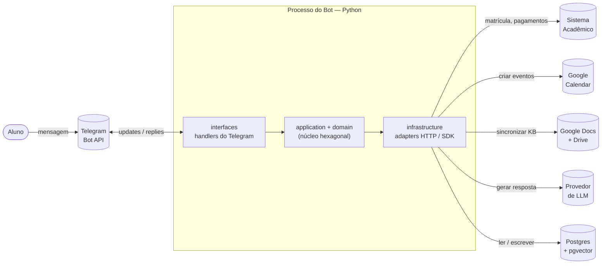

# Diagrama de Containers

Visão interna do sistema: como o processo do bot se organiza e se conecta às integrações externas e ao banco.

## 1. Visão geral — o bot como container

Três blocos internos no processo do bot:

- **`interfaces/`** — composition root. Recebe updates do Telegram e dispara casos de uso.
- **`application + domain`** — núcleo hexagonal: casos de uso, entidades, ports. Sem dependências externas.
- **`infrastructure/`** — adapters concretos que implementam os ports e falam com o mundo (HTTP, SDKs, banco).

A leitura é igual à do [[01-Arquitetura/Diagrama-Contexto|diagrama de contexto]]: cilindros = sistemas/storage externos ao processo; caixas = código nosso.

## 2. Camadas × bounded contexts

Cada bounded context tem fatias em todas as camadas. A matriz abaixo lista o que vive onde:

| Bounded context | `domain/` (entidades + ports) | `application/` (casos de uso) | `infrastructure/` (adapters concretos) |
|---|---|---|---|
| [[02-Dominios/Matricula\|Matrícula]] | `Aluno`, `Matricula`, `StatusMatricula` port: `MatriculaRepository` | `ConsultarMatricula`, `VincularContaTelegram` | `sistema_academico/` (HTTP) |
| [[02-Dominios/Financeiro\|Financeiro]] | `Pagamento`, `StatusPagamento` port: `FinanceiroRepository` | `ConsultarProximoPagamento`, `ListarPagamentosPendentes` | `sistema_academico/` (HTTP) |
| [[02-Dominios/Calendario\|Calendário]] | `EventoCalendario`, `Audiencia` ports: `CalendarioRepository`, `CalendarioExterno`, `OAuthGoogleStore` | `ConsultarCalendario`, `AdicionarAoGoogleCalendar`, `IniciarOAuthGoogle` | `persistence/` (Postgres) + `google/calendar/` |
| [[02-Dominios/Conhecimento\|Conhecimento]] | `DocumentoKB`, `ChunkKB` ports: `KbRepository`, `KbSyncSource`, `EmbeddingGateway` | `BuscarConhecimento`, `SincronizarKB` | `persistence/` (pgvector) + `google/docs/` + `llm/` (embeddings) |
| [[02-Dominios/Conversa\|Conversa]] | `Intencao`, `Persona`, `RespostaLLM` port: `LLMGateway` | `ProcessarMensagem` (orquestrador), `ClassificarIntencao`, `GerarResposta` | `llm/` (Gemini / Anthropic / OpenAI / Groq / Ollama) |
| [[02-Dominios/Observabilidade\|Observabilidade]] | `Interacao` port: `InteracaoLog` | `RegistrarInteracao` | `persistence/` |

> Regras de dependência: `domain` não importa de outras camadas; `application` importa só de `domain`; `infrastructure` implementa ports de `domain`; `interfaces/telegram_bot` é o composition root que conecta tudo. Detalhes em [[01-Arquitetura/Arquitetura-Hexagonal-DDD]].

## 3. Fluxo de uma mensagem

O orquestrador (`ProcessarMensagem`, em [[02-Dominios/Conversa]]) recebe o texto, classifica a intenção, dispara um ou mais casos de uso de contexto para coletar dados, chama o `LLMGateway` para formatar a resposta, e dispara o `RegistrarInteracao` em background.

Sequência completa: [[01-Arquitetura/Fluxos/Fluxo-Mensagem-Generico]].
Variações por intenção: [[01-Arquitetura/Fluxos/Fluxo-Matricula|matrícula]] · [[01-Arquitetura/Fluxos/Fluxo-Pagamentos|pagamentos]] · [[01-Arquitetura/Fluxos/Fluxo-Calendario|calendário]] · [[01-Arquitetura/Fluxos/Fluxo-FAQ-RAG|FAQ/RAG]] · [[01-Arquitetura/Fluxos/Fluxo-Logging|logging]].

## 4. Pontos de extensão (ports principais)

| Port (no `domain`) | Adapter atual (em `infrastructure`) | Substituível por |
|---|---|---|
| `MatriculaRepository` | `sistema_academico/` | Outro ERP / sistema acadêmico |
| `FinanceiroRepository` | `sistema_academico/` | Idem |
| `CalendarioRepository` | `persistence/` (Postgres) | Outro storage |
| `CalendarioExterno` | `google/calendar/` | Outlook / Apple Calendar |
| `KbRepository` (vetor) | `persistence/` (pgvector) | Qdrant / Pinecone / Chroma |
| `KbSyncSource` | `google/docs/` | Notion / Confluence / arquivos locais |
| `LLMGateway` | `llm/` | Qualquer outro provedor |
| `EmbeddingGateway` | `llm/` | Modelo local (`sentence-transformers`) |
| `InteracaoLog` | `persistence/` | Qualquer outro sink (ELK, BigQuery, …) |
