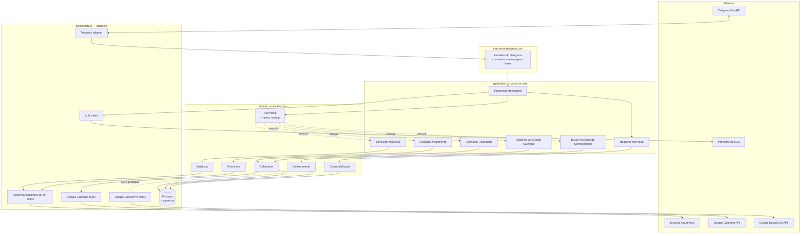

# Diagrama de Containers

Visão interna do bot: principais componentes lógicos e como se comunicam.

## Leitura

- **Setas cheias**: chamada síncrona durante o atendimento de uma mensagem.
- **Setas pontilhadas**: relação assíncrona ou esporádica (intent routing interno, sincronização periódica da KB).
- O **caso de uso "Processar Mensagem"** (`uc_conv`) é o orquestrador central — recebe a mensagem do handler, decide a intenção via [[02-Dominios/Conversa]], dispara os casos de uso pertinentes, monta o contexto, chama a LLM para formatar a resposta, e dispara o registro da interação.

## Pontos de extensão (ports principais)

| Port (no `domain`) | Adapter atual (em `infrastructure`) | Substituível por |
|---|---|---|
| `MatriculaRepository` | `infrastructure/sistema_academico` | Outro ERP / sistema acadêmico |
| `FinanceiroRepository` | `infrastructure/sistema_academico` | Idem |
| `CalendarioRepository` | `infrastructure/persistence` (Postgres) | Outro storage |
| `CalendarioExterno` | `infrastructure/google/calendar` | Outlook / Apple Calendar |
| `KbRepository` (vetor) | `infrastructure/persistence` (pgvector) | Qdrant / Pinecone / Chroma |
| `KbSyncSource` | `infrastructure/google/docs` | Notion / Confluence / arquivos locais |
| `LLMGateway` | `infrastructure/llm` | Qualquer outro provedor |
| `InteracaoLog` | `infrastructure/persistence` | Qualquer outro sink (ELK, BigQuery...) |

→ Fluxos detalhados em [[01-Arquitetura/Fluxos/Fluxo-Mensagem-Generico]]
