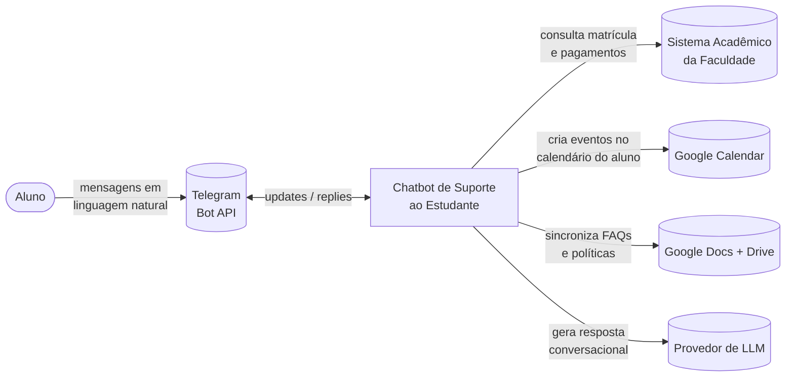

# Diagrama de Contexto

Visão de mais alto nível: o bot como uma caixa preta e seus relacionamentos com atores externos.

## Relações com bounded contexts

- **Telegram** → entrada/saída, atendida por [[02-Dominios/Conversa]]
- **Sistema Acadêmico** → fonte de [[02-Dominios/Matricula]] e [[02-Dominios/Financeiro]]
- **Google Calendar** → destino de "add to calendar" em [[02-Dominios/Calendario]]
- **Google Docs/Drive** → fonte da [[02-Dominios/Conhecimento]]
- **LLM** → motor de geração usado pela [[02-Dominios/Conversa]]
- Toda interação é registrada por [[02-Dominios/Observabilidade]]

→ Detalhe interno: [[01-Arquitetura/Diagrama-Containers]]
