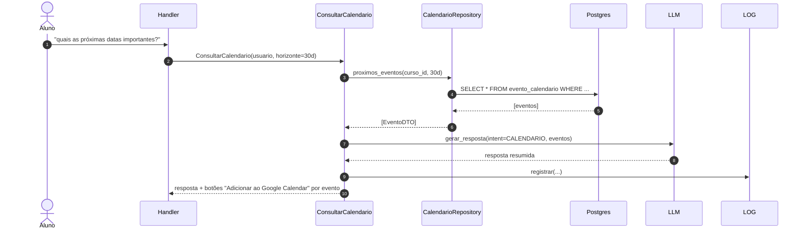
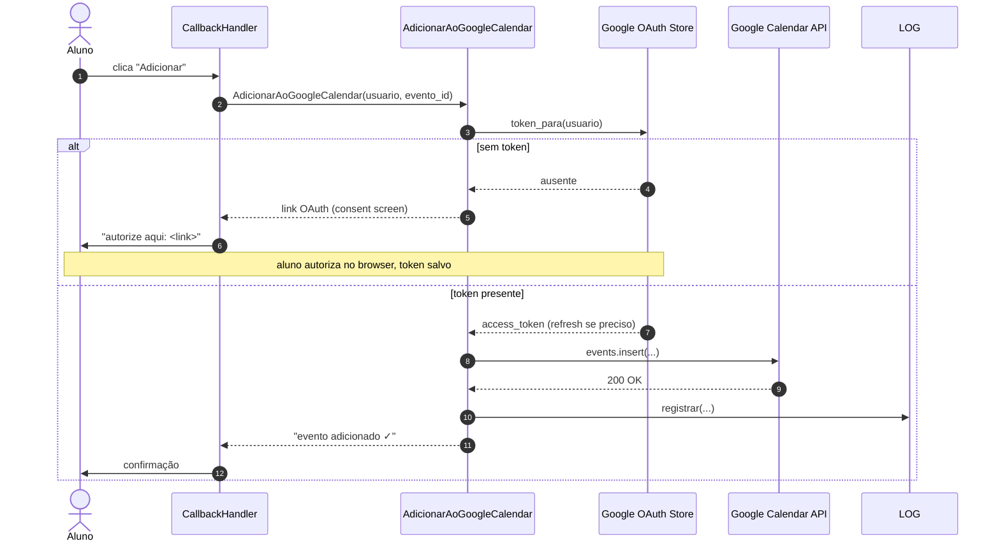

# Fluxo — Calendário e "Adicionar ao Google Calendar"

São dois subfluxos relacionados:

## A) Consultar próximos eventos do calendário acadêmico

## B) Adicionar evento ao Google Calendar do aluno

Acionado quando o aluno clica num botão inline com `callback_data` referenciando um `evento_id`.

## Notas

- A **fonte de verdade do calendário** é o banco interno (todos os eventos institucionais são cadastrados lá). O Google Calendar é apenas destino opcional, por solicitação do aluno.
- O **OAuth do Google é por aluno**: cada usuário do bot precisa autorizar uma vez. O token (com refresh) é armazenado criptografado no banco. Ver [[03-Integracoes/Google-Calendar]].
- Eventos enviados ao Google Calendar incluem `extendedProperties.private.bot_evento_id` para deduplicação caso o aluno clique duas vezes.

→ [[02-Dominios/Calendario]] | [[03-Integracoes/Google-Calendar]]
