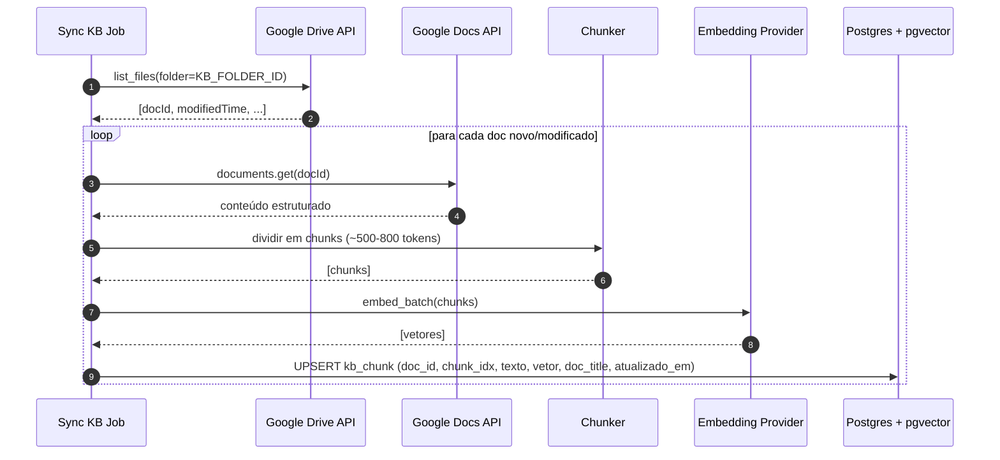
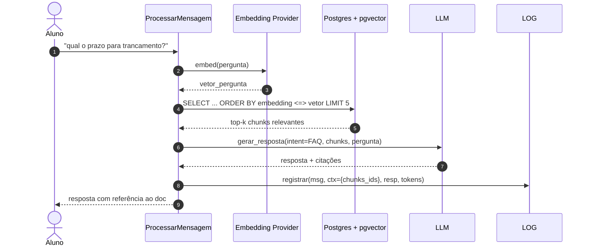

# Fluxo — Base de conhecimento com RAG

Dois subfluxos: **ingestão** (offline, agendada) e **consulta** (online, durante a conversa).

## A) Ingestão — sincronização do Google Docs

Roda como job agendado (cron) ou comando manual (`scripts/sync_kb.py`).

## B) Consulta — RAG durante a conversa

## Notas

- **Cache de embedding** da pergunta é opcional; perguntas repetidas se beneficiariam.
- O LLM recebe os chunks **citáveis** (com `doc_title`); a resposta deve incluir referência ("Conforme a política X, ...").
- **Limite de tokens de contexto**: se top-k for grande, truncar pelo orçamento do prompt — registrar quando isso ocorre.
- **Alucinação**: a instrução de sistema deve enfatizar "se a resposta não estiver nos trechos, diga que não sabe".
- **Reindexação**: chunks órfãos (docs deletados/movidos) devem ser limpos no job.

## Decisões pendentes

- **Estratégia de chunking**: por seção (header-based) é mais aderente a docs institucionais; fixed-size é mais simples. Decisão na primeira iteração.
- **Modelo de embedding**: ver comparativo em [[04-Operacoes/Custos-e-Alternativas-Gratuitas]].

→ [[02-Dominios/Conhecimento]] | [[03-Integracoes/Google-Docs-Drive]]
