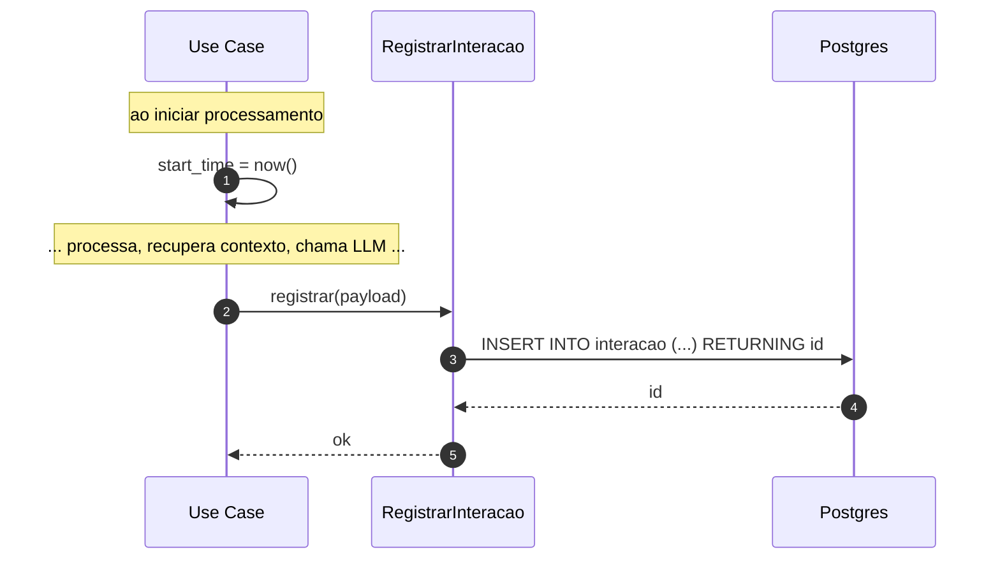

# Fluxo — Registro de interação

Toda interação respondida pelo bot **deve** produzir um registro completo. Esta seção define exatamente o que é capturado e quando.

## O que é registrado

| Campo | Origem | Obrigatório |
|---|---|---|
| `id` | gerado | sim |
| `aluno_id` | sessão Telegram | sim |
| `telegram_user_id` | update.from.id | sim |
| `chat_id` | update.chat.id | sim |
| `mensagem_recebida` | texto bruto do usuário | sim |
| `intencao_detectada` | resultado do intent routing | sim |
| `contexto_recuperado` | JSON com IDs/conteúdos consultados (matrícula, pagamento, chunks da KB, eventos...) | sim |
| `resposta_enviada` | texto final que foi para o Telegram | sim |
| `llm_provider` | provedor usado (gemini/claude/...) | sim |
| `llm_model` | modelo exato | sim |
| `tokens_entrada` | tokens consumidos na requisição (prompt + contexto) | sim |
| `tokens_saida` | tokens gerados na resposta | sim |
| `latencia_ms` | tempo total de processamento | sim |
| `erro` | mensagem de erro caso ocorra (NULL se OK) | não |
| `criado_em` | timestamp | sim |

## Fluxo

## Garantias

- O registro acontece **mesmo em caminhos de erro** (try/finally no use case principal). Se a LLM falhou, ainda registramos a falha com `erro` preenchido e `tokens_*` em zero.
- O `contexto_recuperado` é serializado em JSON. Dados sensíveis (PII, valores monetários) podem ser pseudonimizados conforme política — decisão pendente.
- **Não bloqueia a resposta**: o INSERT é feito em background (`asyncio.create_task`) com tratamento de exceção que vai para log de aplicação. A resposta ao aluno não espera o registro.

## Sobre contagem de tokens

Cada provedor de LLM retorna a contagem de tokens na resposta:
- **OpenAI / Anthropic / Gemini**: `usage.input_tokens` e `usage.output_tokens` (nomes variam, mas o conceito é o mesmo).
- **Groq**: idem (compatibilidade OpenAI).
- **Ollama local**: também retorna `prompt_eval_count` e `eval_count`.

A camada `LLMGateway` normaliza esses nomes para `tokens_entrada` / `tokens_saida` antes de devolver à aplicação.

## Consultas analíticas previstas

- Custo estimado por aluno por mês (tokens × preço unitário do provedor)
- Intenções mais comuns (para priorizar evolução)
- Latência p50/p95
- Taxa de erro por integração

→ [[02-Dominios/Observabilidade]] | [[05-Modelagem/Schema-Banco]]
