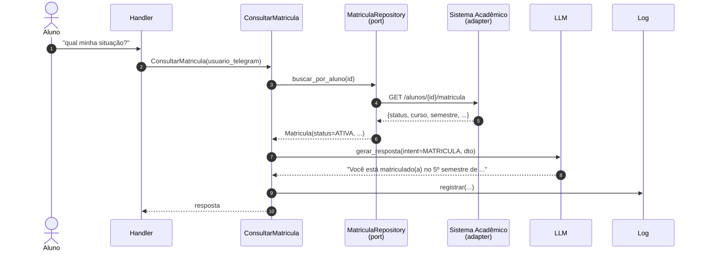

# Fluxo — Consulta de matrícula

## Pontos de atenção

- O aluno é identificado pelo `telegram_user_id`. O mapeamento `telegram_user_id → matricula_id` deve estar no banco (tabela `aluno`); o primeiro contato exige um onboarding/autenticação. Ver [[02-Dominios/Matricula]] para o fluxo de vínculo.
- Possíveis status (linguagem ubíqua): `ATIVA`, `TRANCADA`, `CANCELADA`, `FORMADO`, `INADIMPLENTE`. Ver [[05-Modelagem/Glossario-Ubiquo]].
- Em caso de falha do sistema acadêmico, a resposta deve degradar graciosamente ("não consegui consultar agora, tente em alguns minutos") e o erro entra no log.

→ Ver também [[03-Integracoes/Sistema-Academico]]
