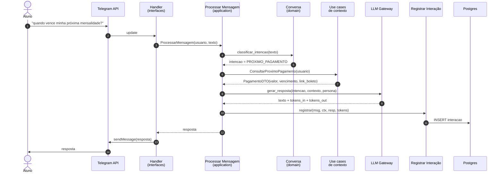

# Fluxo — Mensagem genérica

Sequência canônica de uma mensagem qualquer chegando pelo Telegram.

## Notas

- **Intent routing** começa simples (heurísticas + few-shot na LLM) e pode evoluir para classificador dedicado se necessário. Ver [[02-Dominios/Conversa]].
- O passo `gerar_resposta` recebe o contexto **estruturado** (DTOs), não dados brutos da API externa — isso isola o prompt da forma da integração.
- O registro de interação acontece **sempre**, inclusive em caminhos de erro. Ver [[01-Arquitetura/Fluxos/Fluxo-Logging]].
- Caso a intenção exija múltiplos contextos (ex.: "me lembra do calendário e quando vence?"), o use case dispara em paralelo e agrega.

## Variações relevantes

- [[01-Arquitetura/Fluxos/Fluxo-Matricula]]
- [[01-Arquitetura/Fluxos/Fluxo-Pagamentos]]
- [[01-Arquitetura/Fluxos/Fluxo-Calendario]]
- [[01-Arquitetura/Fluxos/Fluxo-FAQ-RAG]]
