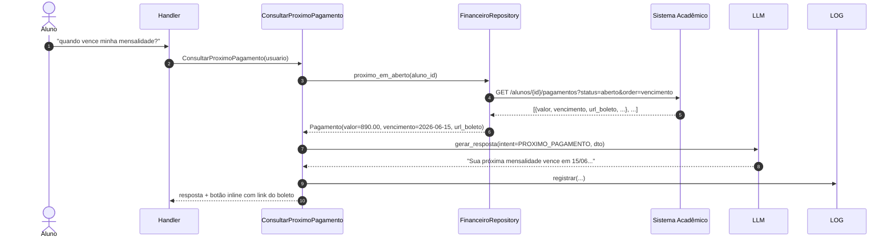

# Fluxo — Próximo pagamento

## Detalhes

- A resposta no Telegram aproveita **inline keyboard** para o link do boleto, em vez de embutir URL no texto livre (melhor UX).
- O **link do boleto** vem do sistema acadêmico; o bot apenas repassa. Não armazenamos PDFs.
- Se não há pagamento em aberto, a resposta deixa isso claro ("você não tem mensalidades em aberto").
- Estados financeiros relevantes na linguagem ubíqua: `EM_ABERTO`, `PAGO`, `VENCIDO`, `EM_NEGOCIACAO`.

→ [[02-Dominios/Financeiro]] | [[03-Integracoes/Sistema-Academico]]
